好的，根据您的要求，我将对视频内容进行更深入、更详细的讲述线梳理，并输出为 Markdown 文档。

---

# 深入解析《赛博朋克 2077》中的互动电影场景

**演讲者：** Filip Pierściński (CD Projekt RED 首席电影程序员)
**主题：** Introduction of the Interactive Cinematics in 'Cyberpunk 2077'
**关键词：** FPP 电影场景、Syeditor 工具、图表系统、动作分段。

---

## 一、开场与项目背景 (00:00:00 – 00:05:55)

### 1.1 欢迎与自我介绍 (00:00:00 – 00:02:45)

* **演讲者身份：** CD Projekt RED 首席电影程序员 **Filip Pierściński**。
* **演讲内容：** 将介绍在《赛博朋克 2077》中使用的**工具**、**管道**（Pipeline）和**实现方法**。
* **项目致谢：** 演讲中讨论的技术和工具由**国家研究开发中心**的“电影领域”项目支持。该项目旨在通过创新的管道和定制工具包，在高端开放世界游戏中提供独特的电影体验。
* **个人履历：** 曾参与《两个世界 II》、《巫师 3：狂猎》、《巫师 3：石之心》、《巫师 3：血与酒》和《赛博朋克 2077》。
* **团队致谢：** 特别感谢所有参与《赛博朋克 2077》场景制作的团队成员（电影设计师、故事编剧、任务设计师、程序员、QA 等）。

### 1.2 游戏背景与情绪渲染 (00:02:48 – 00:05:55)

* **游戏设定：** 设定在**夜之城**（Night City）的开放世界动作冒险故事，一个痴迷于权力、魅力、身体改造的城市。
* **叙事基调：** 夜之城的生活艰难，没有好的选择，每个决定都有后果。
* **场景作用：** 电影场景反映了游戏中的极端情绪、危险关系和曲折情节。
* **预告片：** 播放一段预告片以更好地捕捉电影领域的精髓。

---

## 二、互动场景的三个关键挑战

### 2.1 第一人称视角 (FPP) 的沉浸式故事 (00:06:57 – 00:09:07)

* **选择原因：** FPP 是实现沉浸式故事最自然的选择。
* **动画制作难度：** 摄像机必须被制作动画。**微小的错误**（如动画数据或计算中的错误）都可能导致摄像机在帧之间突然移动。
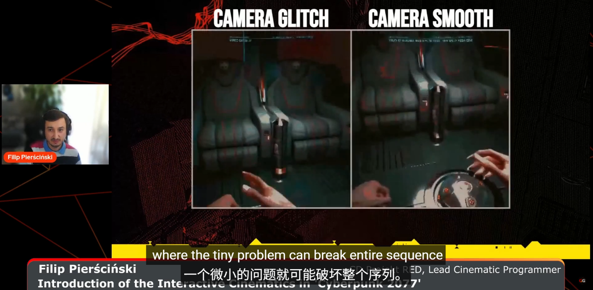
* **后果：** 任何不自然的跳动或晃动都会**严重破坏沉浸感**。

### 2.2 玩家作为演员 (Player as an Actor) (00:09:08 – 00:09:46)
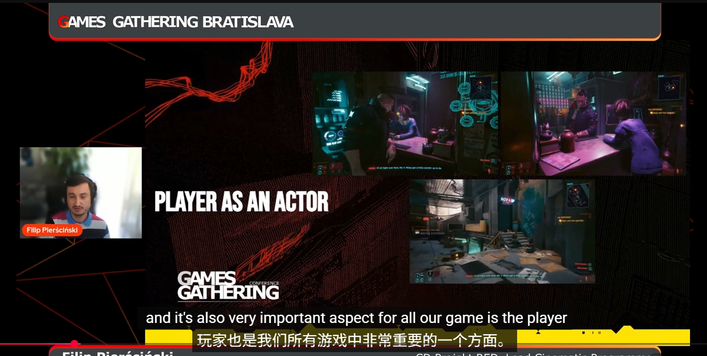
* **玩家参与度：** 玩家角色（V）积极参与场景，并且在大部分时间内都在屏幕上。因此所听到的看到的内容会比之前固定着摄像机看要多得多

* **制作成本：** 由于玩家始终在场，无法使用常见的“烟雾和镜子”技术来隐藏角色或环境，因此**无法有效降低制作成本**。

### 2.3 双主角版本 (Female or Male Protagonist) (00:09:46 – 00:10:31)

* **版本数量：** **90%** 的场景需要为**女性 V** 和**男性 V** 制作**两个版本**。
* **复杂性：** 不仅对话台词，许多对话响应和某些特定场景（如浪漫场景）也需要以不同方式构建，以适应不同的主角模型。

---

## 三、场景工具集：SceneEditor
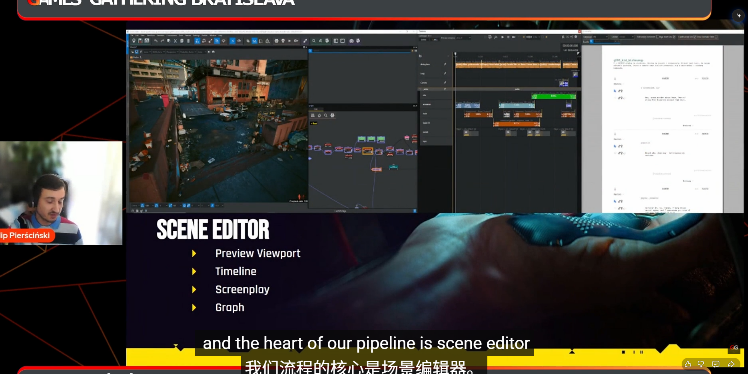
### 3.1 SceneEditor 界面与核心组件 (00:10:31 – 00:11:24)
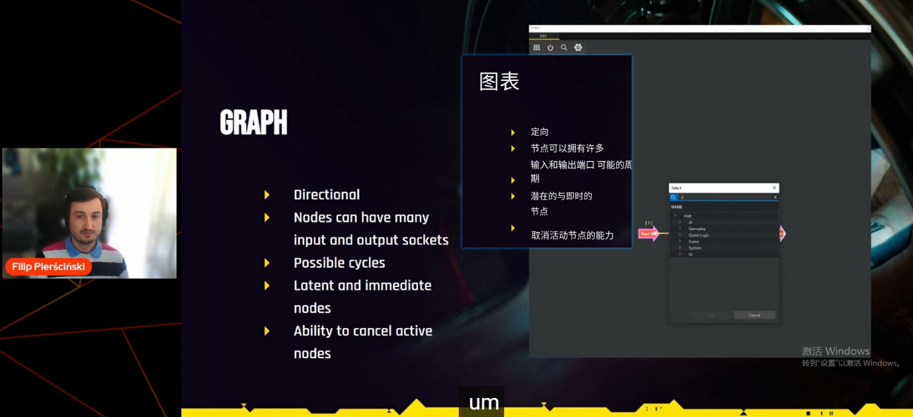
* **地位：** SceneEditor 是互动电影场景制作管道的**核心**工具。
* **四大组件：**
    1.  **预览视口 (Preview Viewport)**
    2.  **时间轴面板 (Timeline Panel)**：包含动画、VFX、对话事件等。
    3.  **图表 (Graph)**：用于控制场景逻辑流程。
    4.  **剧本 (Script)**：位于右侧，是对话视角的剖面图。

### 3.2 图表系统 (The Graph) 的深入解析 (00:11:26 – 00:15:30)
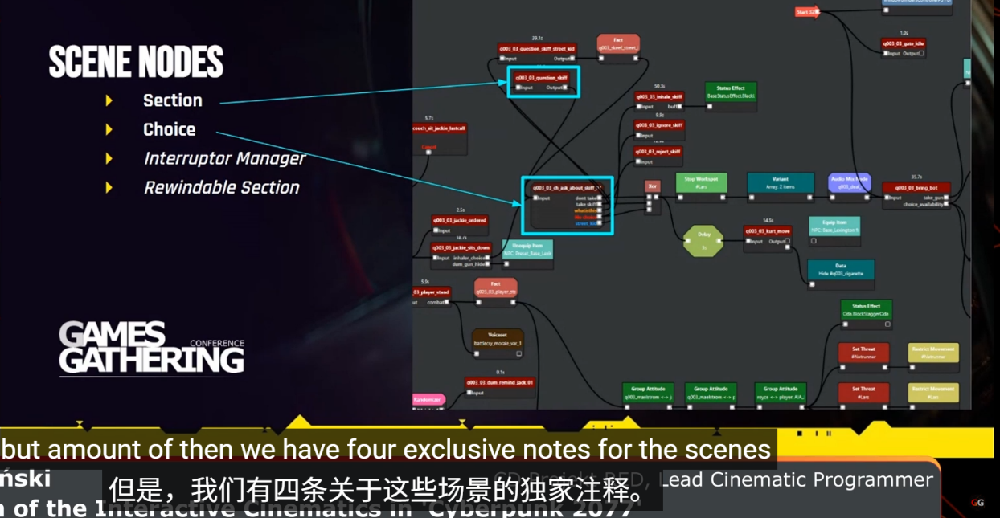
#### **图表结构：**
* **执行方向：** 图表是**定向的**（Directed），信号从一个节点的输出流向另一个节点的输入。
* **连接灵活性：** 节点可以有多个输入和输出，套接字 (Socket) 没有类型，这使得连接非常灵活。
* **核心功能：** 允许在场景中创建**循环**（Loops），这对于重复使用对话台词和任务路径至关重要。
* **节点类型：**
    1.  **潜在节点 (Potential Nodes)：** 在执行之间保持信号或令牌（例如，`Section` 节点）。
    2.  **即时节点 (Instant Nodes)：** 立即执行所有操作（例如，`Start` 节点）。
* **特定节点示例：**
    * `Section`：用于控制场景行为（动画、对话等）。
    * `Reendable Section`：`Section` 的扩展版本，允许场景向后播放。
    * `Choice`：用于实现对话分支，例如玩家选择对话选项。
* **实现考量：** 图表节点在**代码**中实现，而不是蓝图中，这是为了**保证运行时的性能**。

#### **功能概括**
* **结构：** Section和 Choice 节点用于控制场景逻辑。Interrupt 节点用于处理**中断管理**Rewind Able Section 负责在高信息密集情景下保持清晰的给玩家传递信息
* **Braindance Rewind 2077独有的解密过程**
在《赛博朋克2077》中，超梦（Braindance, BD）是一种重要的叙事工具和游戏机制。它让玩家（V）能够重温他人的感官体验，包括视觉、听觉，甚至情感。
    * **核心机制：时间与感官的非线性探索**

   | 功能名称                                  | 目的与作用                                                                                                                                                                                                   |
   | ----------------------------------------- | ----------------------- |
   | 回溯/快进（Rewind/Fast Forward）          | 允许玩家在时间轴上自由移动。这不同于观看视频，玩家是在体验中移动，可以精确地定位到事件发生前的瞬间或重复某个动作。                                                                                           |
   | 感官切换（Thermal, Audio, Visual Layers） | 允许玩家在“视觉层”（Visual）、“音频层”（Audio）和“热源层”（Thermal）之间切换扫描。这是解密的关键，因为重要的线索可能隐藏在肉眼不可见、但可以通过其他感官捕捉到的信息中（例如，隐藏的通信、环境温度异常等）。 |
   | 扫描（Scanning）                          | 允许玩家在暂停或慢速播放时，扫描环境中的特定对象或线索。只有在正确的时间点和正确的感官层，线索才会浮现。|
	

    * **解密叙事的本质：拼凑信息碎片**
    超梦回溯功能的设计，将原本线性的“过场动画”变成了互动式谜题。其“解密”本质体现在：

        * 时间性线索（Temporal Clues）： 许多线索只在特定时间段内出现。玩家必须在时间轴上回溯，精确地在几秒钟内找到并扫描目标。如果错过，就必须倒带重来。
        例如：一扇门在某个瞬间被打开又关上；某人只在某个特定时刻说了关键的台词。
    
        * 隐藏性线索（Hidden Clues）： 重要的信息往往被故意隐藏在非主要感官层。玩家不能只看“视觉”，可能需要切换到“音频层”来捕捉一段背景对话，或者切换到“热源层”来发现一段隐藏的布线或窃听器。例如：在“视觉层”看不到对话双方的第三者，但在“音频层”能捕捉到第三者的声音。

        * 增强叙事： 这种机制使玩家从被动接受者转变为主动调查者。玩家在超梦中发现的每个线索，都感觉是自己努力拼凑出的结果，极大地增强了代入感和对故事的理解。

* **Interrupt 概念**
	“Interrupt”是指场景或过场动画（Cinematic）在预定流程中，因外部事件的触发而紧急停止或跳转到另一个状态或路径的能力。
    这就是一个典型的“中断”需求。在开放世界第一人称游戏中，玩家的自由度极高：
    * 玩家自由行为： 玩家可能在对话进行到一半时，突然转身离开、拔出武器、跳到桌子上，或与附近的NPC发生冲突。
    * 游戏世界的动态性： 场景进行时，可能触发环境事件（如爆炸、警报、旁观者介入）。
    * Interrupt图表节点用于定义哪些外部信号（如“玩家拔枪”、“区域退出”、“被攻击”）能中断当前场景，以及中断后应该跳转到哪个新的场景节点（如“战斗启动”或“NPC逃跑”）。

| 游戏                    | 中断机制的应用                                                                                                                                                      |
| ----------------------- | ------------------------------------------------------------------------------------------------------------------------------------------------------------------- |
| 《荒野大镖客2》（RDR2） | 玩家如果在城镇中与NPC对话时，突然推撞路人或越过禁止区域，对话会立即中断，NPC会改变态度（例如从友好转向愤怒或惊恐），场景也可能被警察介入中断。                      |
| 《巫师3：狂猎》         | 在很多任务对话中，如果玩家控制杰洛特跑远，对话会中断，NPC可能会喊话让玩家回来。                                                                                     |
| 《质量效应》系列        | 标志性的Renegade Interrupts（叛逆中断）。在对话中，特定的时刻屏幕上会弹出按键提示，允许玩家立即打断当前对话，执行一个激烈的行动（如开枪、推人），直接改变场景走向。 |

	
	
	

### 3.3 数据处理与运行时优化 (00:15:50 – 00:30:04)
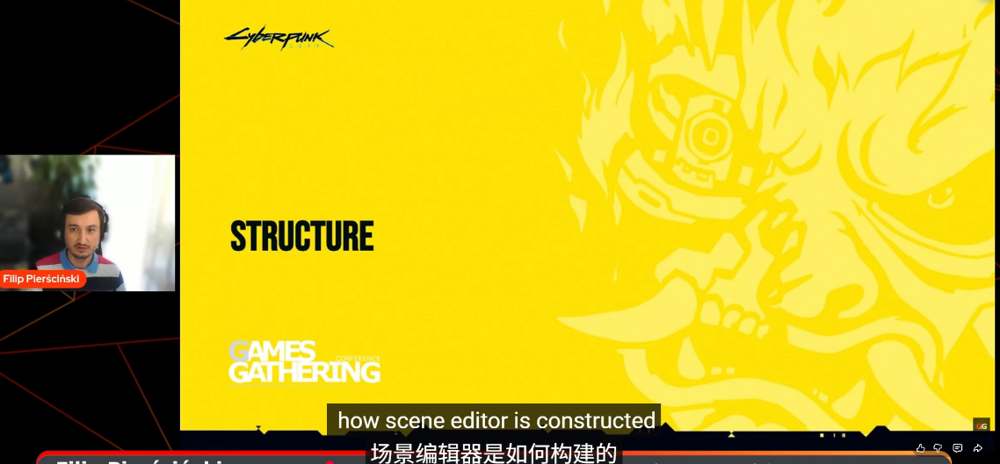
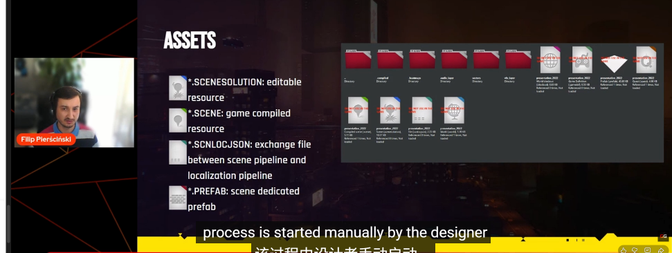
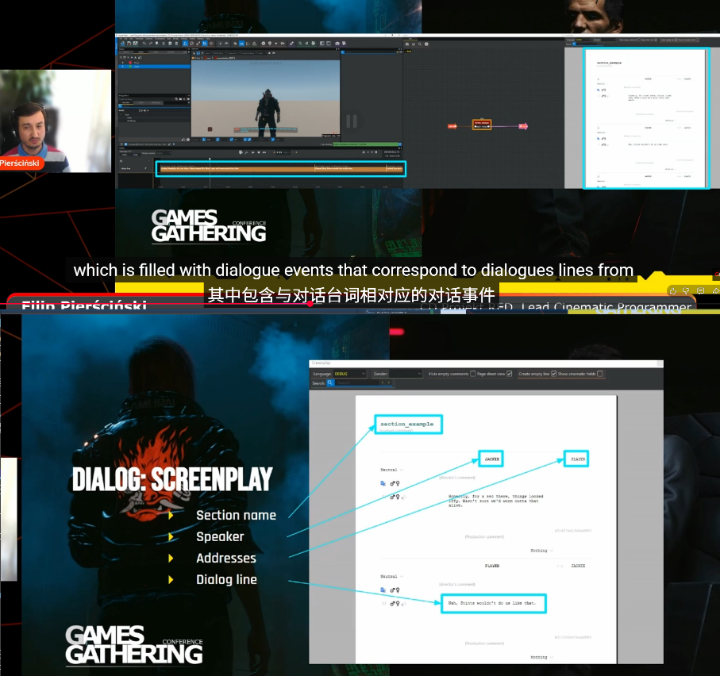
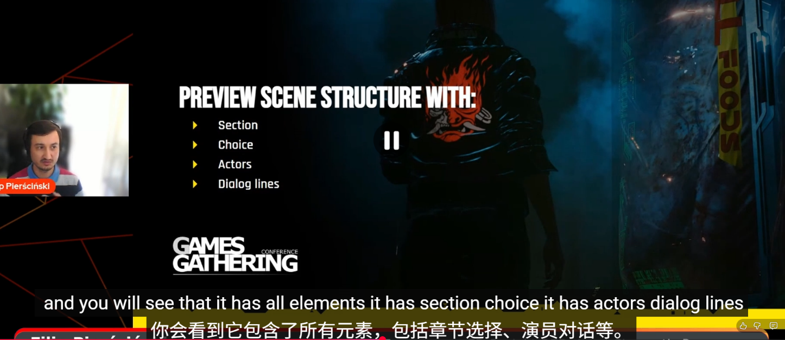
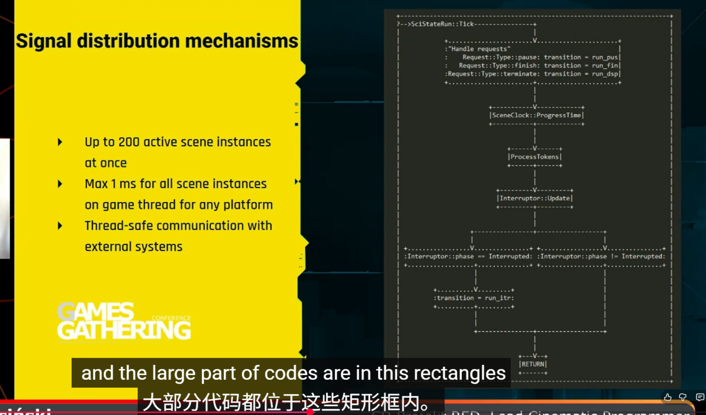
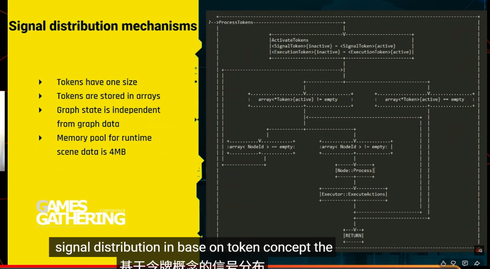
* **时间线内部结构：** 时间线在内部是一个**事件列表**（List of Events），每个事件包含 ID、开始时间、持续时间、类型和参数。
* **文件格式：** 场景文件保存为 **.scn 文件**（JSON 格式），便于设计师编辑和版本控制。专门的 **Cn log .json** 文件用于导出文本源以进行本地化。
* **运行时执行：** 场景逻辑是**通过解释图表数据**在运行时执行的。
* **信号令牌机制：** ❓  分组更新Time Slicing提高优化
  
    * **令牌 (Tokens)：** 包括 **Active Token** 和 **Inactive Token**。Token 概念的出现是为了解决在保持性能的同时，高效管理和更新复杂场景逻辑图。
    * **不活动令牌的作用：** 它用于在帧之间保持信号，并控制**时间预算**。它的核心作用是将节点（尤其是一些耗时的节点）的执行分散到不同的帧中，避免单帧计算压力过大，确保场景的平滑运行。
* **内存优化：** 实现了**状态内存**和**图表数据内存**的分离，从而减少了场景的内存开销。运行时场景数据池被减少到 **2-4 MB**，有效避免了内存碎片化问题。

---

## 四、场景 调度/分段（Staging）方法
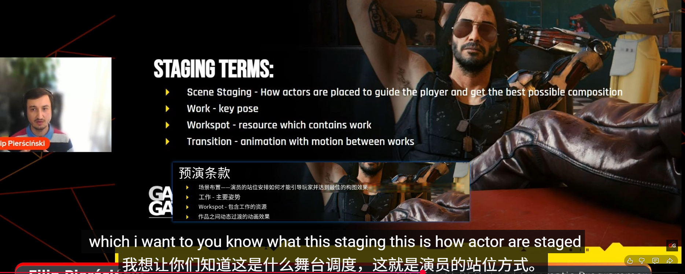
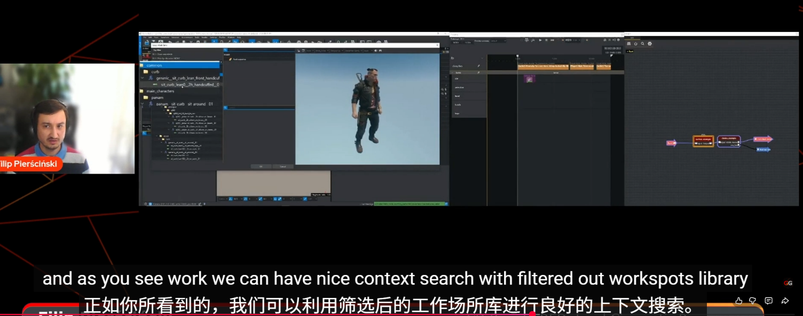
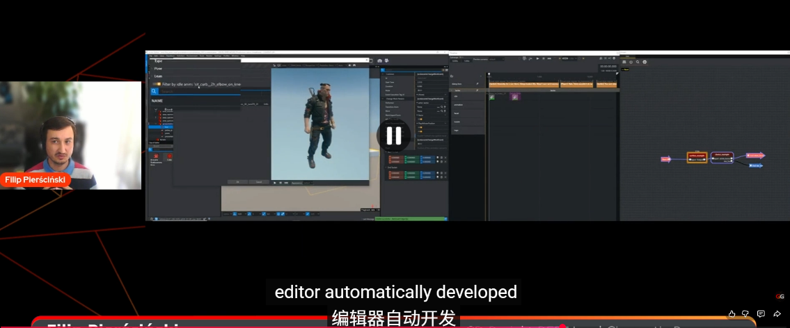
针对现有Workspot转变时候有功能先对针对目前编辑的角色动画进行一次过滤
关键姿势是一种特殊的动画
### 4.1 分段职责与动作 (Work) (00:30:04 – 00:35:38)
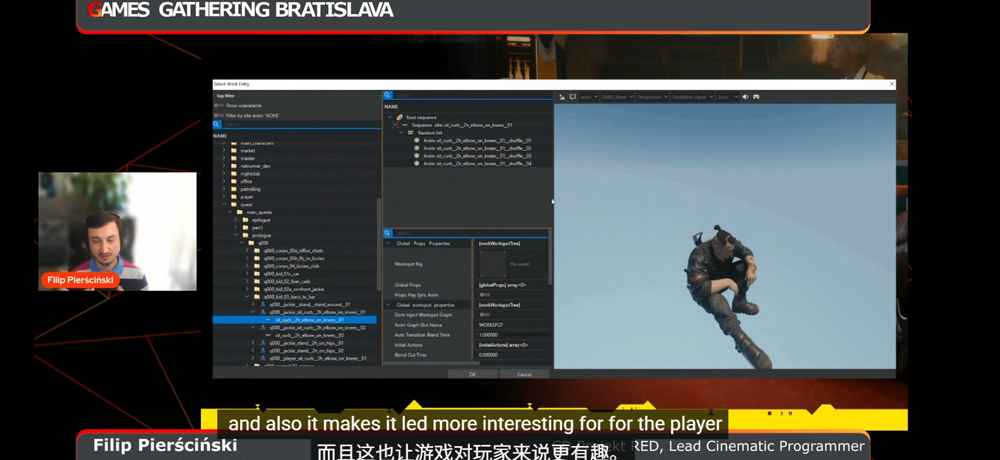
切换动作时做到了随机播放切换动作动画
* **分段制作：** 由电影设计师在任务设计师提供的基本结构基础上完成。
* **`Work` 事件：** 用于为角色添加或切换动作状态。`Work` 中包含角色的动画（例如闲置动画、附加动画）。
* **成本削减：** 角色状态之间的过渡是**动态混合**的，而非为每种组合预录制过渡动画。这大大**削减了制作成本**。设计师可以手动选择最合适的过渡来保持平滑。
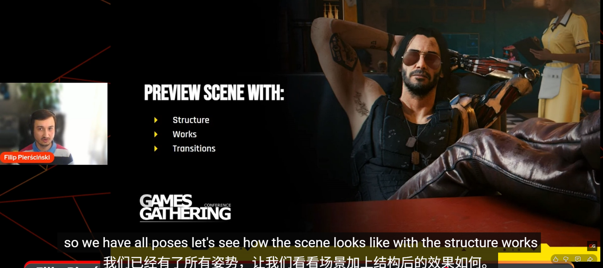
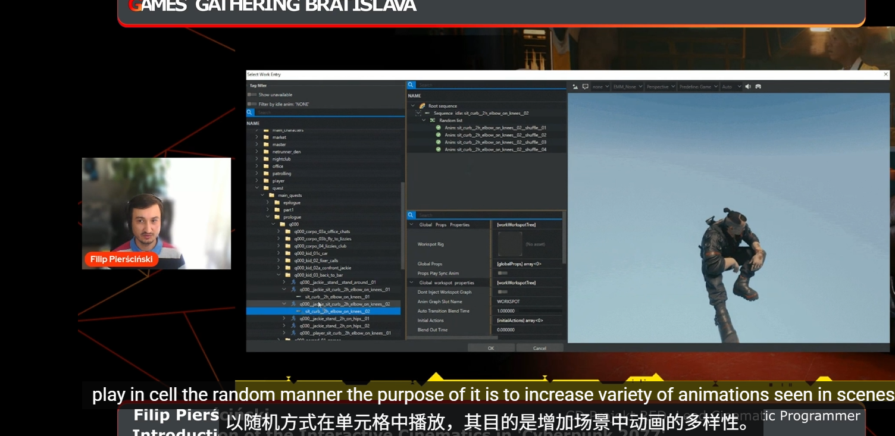

### 场景调度（Staging）机制：Works与Transitions的技术实现
场景调度（Staging）是电影设计师定义演员在场景中的位置、姿态和引导玩家视线的方式 [1] (00:30:12-00:30:26)。其核心技术构建于 Works（工作状态）和 Transitions（过渡动画）之上。

* **Works：演员的逻辑AI状态与动画容器**
* Work（工作状态）并非简单的动画剪辑，而是一种高级抽象，可将其视为“关键姿势”（Key Post） [1] (00:32:33-00:32:55)。然而，在运行时，Work代表了实体的整个逻辑AI状态 [1] (00:33:52-00:33:56)。

    * Work的持续性和驱动： Work通过Change Work Event放置在时间线上，尽管该事件本身是点事件（Point Event），但Work所代表的姿态（例如，坐下并将手放在膝盖上）会在场景中循环执行，直至下一个Work或Transition事件将其取代 [1] (00:33:43-00:33:52)。

    * Work资源的分层结构： 为了增加动画的多样性和真实感，Work资源设计为多层结构。除了基础的闲置动画（Idle Animation）定义核心姿态外，Work还包含附加动画（Additive Animation）。这些附加动画以半随机的方式播放，叠加在Idle动画之上，目的是增加动画变化，例如增加细微的身体晃动或面部表情变化，使演员看起来更自然、场景更具趣味性 [1] (00:33:01-00:33:13)。

    * Change Work Event参数： 设计师通过此事件指定目标实体（Target Entity，如Jackie）和目标Work资源（Work），并通过Work Picker进行选择 [1] (00:31:41-00:32:07)。

* **2.2 Transitions：实现状态切换的动画混合技术**
Transition（过渡）是连接两个Work状态之间的动画序列，用于实现姿态之间的平滑切换 [1] (00:30:50-00:31:00)。这是保障FPP视角下沉浸感不被打破的关键。

    * **过渡动画选择的挑战**： 鉴于Work的数量庞大，记录所有Work-to-Work组合之间的过渡动画在物理上和制作预算上都是不可行的 [1] (00:35:00-00:35:14)。

    *  **自动推导与匹配机制**： 为了解决这一问题，Syeditor采用了上下文感知和自动推导（Deduction）机制。

        * 当设计师设定一个新的Work状态时，系统能够推导出演员在时间轴上该点之前的实时状态（前一个姿势） [1] (00:34:21-00:34:39)。

        * 基于这种推导能力，系统能够从Transition库中自动建议（Auto-Suggestion）最匹配当前状态到目标Work状态的过渡动画 [1] (00:34:18-00:34:27)。 这种基于姿势匹配和状态推导的系统架构，与现代游戏引擎中采用的**运动匹配（Motion Matching）**或基于姿势搜索的动画技术高度相似 [4]。其核心价值在于，通过计算角色当前状态与目标Work姿势之间最小化位移和速度差异的代价，选择或混合出一个最优的通用过渡剪辑，大幅减少了设计师手动设置或调整动画状态机逻辑的需求。

    * **动画混合的数学基础**： 动画混合（Blending）的质量决定了过渡是否平滑。

        * 对于骨骼的位置（Position）插值，通常采用线性插值（LERP） [5]。

        * 对于骨骼的方向或旋转（Orientation/Rotation）插值，必须使用球面线性插值（SLERP）。这是因为 LERP 在处理四元数时，若两端旋转角度较大，可能会导致插值路径非线性，或导致中间的四元数失去单位性，从而产生不自然的动画效果 [5]。SLERP通过保持恒定的插值弧长，确保了旋转过渡在视觉上是平滑和一致的 [5]。

* **2.3 Workbook Library：高效内容生产的数据支撑结构**
Workbook Library 是 Work 资源的结构化集合，为设计师提供了加速工作流的机制。

    * 结构化索引和检索： Work Library 是一组Work资源导出文件，通过**命名约定（Naming Convention）**进行组织和分类排序 [1] (00:32:36-00:32:46)。设计师将其理解为包含Work资源的文件夹的“地图视图”（Map View of Folders） [1] (00:32:51-00:32:55)。

    * 工作流优化： Work Picker工具利用这种结构化数据，提供快速的搜索、过滤功能，并结合上下文感知功能（例如自动推导出前一状态）来建议最合适的Work和Transition [1] (00:32:05-00:32:29, 00:34:18-00:34:39)。

    * 高速迭代循环： 这种强大的检索和自动推导能力，结合Syeditor能够在图表的任意时刻开始预览的能力，为电影设计师提供了巨大的“速度增益”（Speed Gag），使得他们能够快速实现和迭代场景变化 [1] (00:34:39-00:34:53)。这是一种典型的数据驱动的内容创建哲学：通过标准化数据结构（命名约定和元数据）和智能工具，将设计精力集中在艺术创作上，而不是手动解决技术连接问题。
### 4.2 事件与动作 (Actions) 的分离 (00:36:06 – 00:41:02)❓Event Track❓
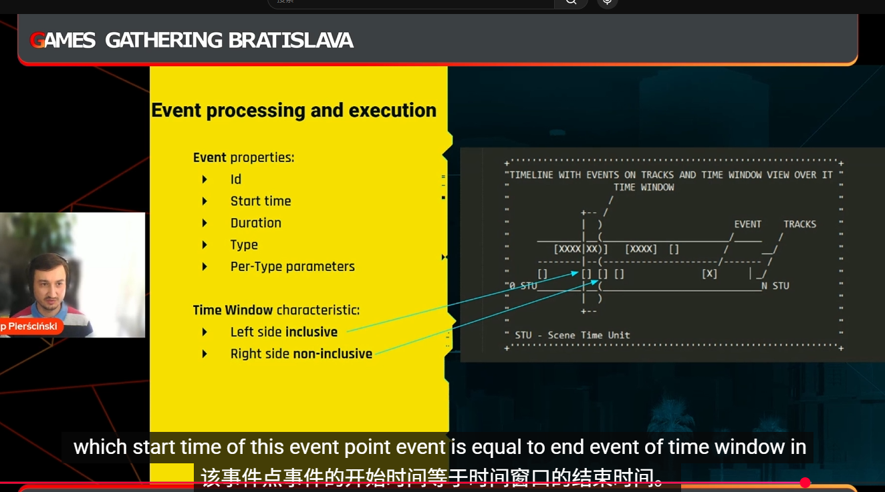
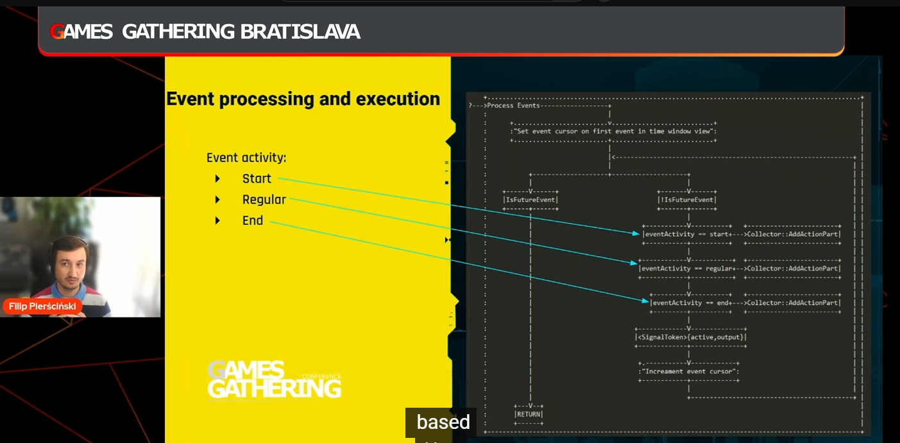
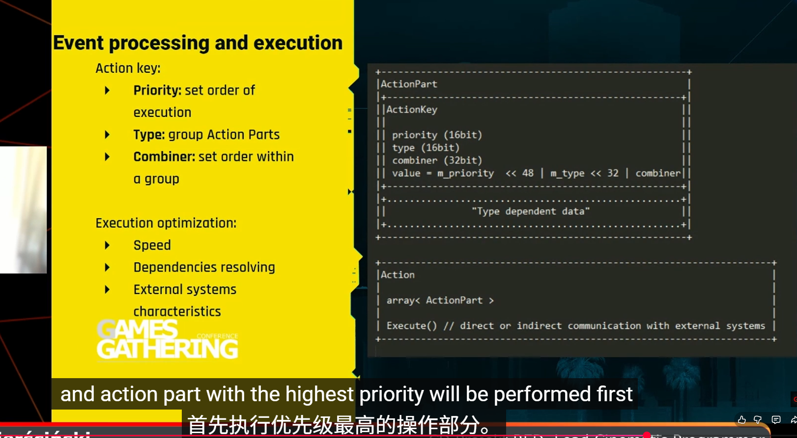优先级概念❓
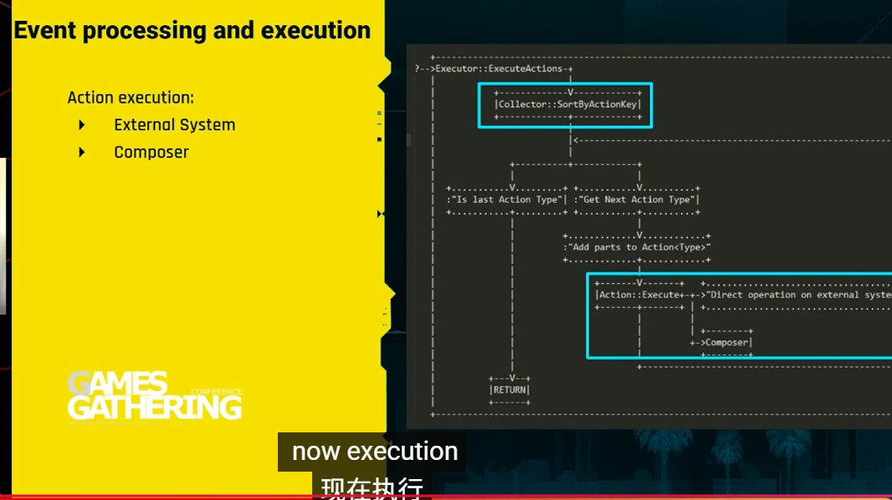作曲家概念❓
* **时间窗口：** 时间线事件的处理是基于**时间窗口**的（左侧包含，右侧不包含），这些窗口由 `Section` 的时间预算转换而来。
* **动作 (Actions) 的创建：** 时间窗口根据与事件的重叠情况生成**动作部分 (Action Pieces)**。
* **关键区别：** **动作 (Actions)** 是在**运行时**创建的，这与静态的事件相反。
* **好处：** 动作与事件的分离提供了**灵活性、良好的排序能力**，并且有助于处理复杂场景实例内的**依赖关系**。
* **总结：** 场景的事件执行过程是通过使用 **Actions** 来分解和管理的。
### 一种优先级机制❓

---

## 五、总结与展望 (00:41:02 – 00:47:33)

* **最终演示：** 演示了加载最终版本的场景预览，包括复杂的环境、口型同步和后期处理效果。
* **结束语：** Filip 感谢观众的参与，并希望这些技术细节对未来的游戏制作有所帮助。
* **招聘信息：** CD Projekt RED 正在招聘，鼓励有兴趣参与互动场景技术工作的人联系他们。
* **问答：** 简短讨论了 FPP 对于沉浸式体验的重要性。