好的，我将根据视频内容，提供一个更加详细的、按时间线整理的文档格式摘要。

# 【GDC24】技术和叙事的碰撞：《赛博朋克2077》的任务编辑器：深度整理

## 1. 演讲介绍与背景 (00:00:07 - 00:02:10)

* **开场与主题 (00:00:07 - 00:00:24):** 演讲标题为“技术与叙事的碰撞：《赛博朋克》任务编辑器”，副标题是“赛博朋克的叙事工具：好的、坏的和令人WTF的”。
* **会前提醒 (00:00:26 - 00:01:28):**
    * 内容将在 GDC 结束后上传，请勿录像。
    * 涉及《巫师3》、《赛博朋克2077》及其资料片《往日之影》的剧透。
* **演讲目标：**
    1.  展示叙事工具背后的设计原则。
    2.  说明这些原则如何在 REDengine 中体现。
    3.  展示团队如何使用这些工具制作《赛博朋克》的任务。
* **讲者与团队 (00:01:28 - 00:02:10):**
    * 讲者 Sarah，CD Projekt Red 的代理任务设计师，现致力于 Project Orion（下一部《赛博朋克》作品）。
    * 叙事工具由一个由大约 15 名程序员组成的团队开发。
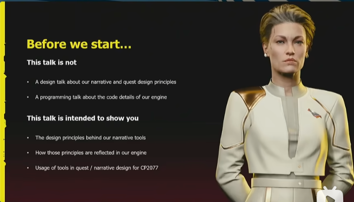
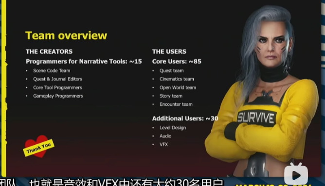
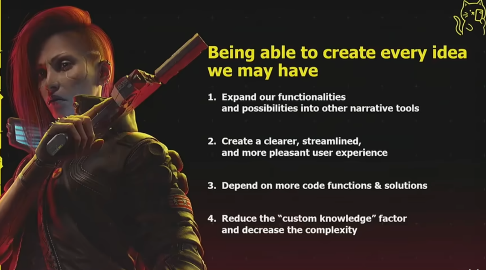
## 2. 核心叙事工具深度解析 (00:02:51 - 00:10:04)
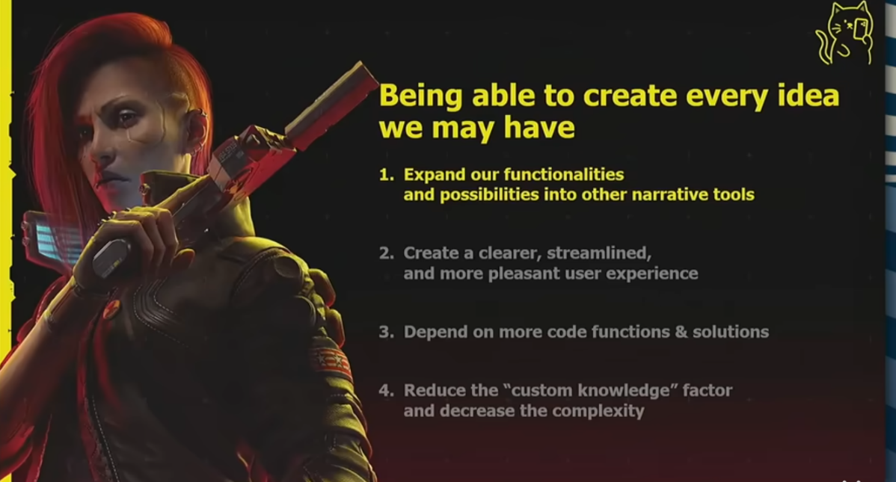
CD Projekt Red 主要使用三个相互关联的工具来构建叙事内容：任务编辑器、场景编辑器和日志编辑器。

### 2.1. 任务编辑器 (Quest Editor) (00:03:00 - 00:06:33)
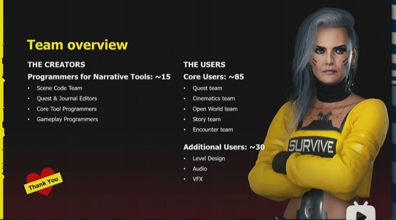
* **功能定位：** 核心逻辑结构，包含整个游戏的逻辑流程，从单个任务到整体叙事结构。
* **实现方式：** 可视化脚本工具（Visual Scripting Tool），用于定义游戏应该做什么，以及它对玩家行为的反应。
* **核心节点类型：**
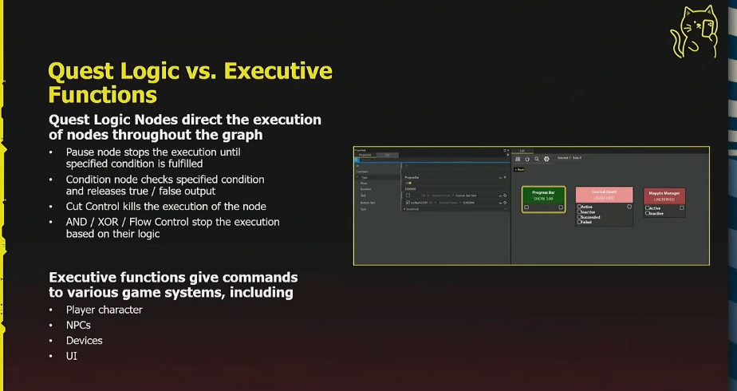
    * **逻辑功能节点：**
        * **暂停节点 (Pause Nodes)：** 等待特定条件被满足或触发后才继续执行。
        * **条件节点 (Condition Nodes)：** 检查某个条件（如玩家是否有某物品，某个任务是否完成）并返回真/假。
        * **截止控制节点 (Cutoff Control Nodes)：** 用于终止执行流程，例如取消正在运行的命令。
        * **流程控制节点 (Flow Control Nodes)：** 控制执行流的路径，例如 AND（都满足）、OR（满足其一）、XOR（仅满足其一）。
    * **执行功能节点 (Execution Nodes)：** 向各种游戏系统发送命令。
        * **角色控制：** 控制玩家角色（如给予物品、施加状态效果）和 NPC 行为。
        * **世界交互：** 控制设备和互动对象。
        * **UI/核心系统：** 管理任务日志、警告信息、天气、淡入淡出效果以及限制玩家行为（如禁用跳跃或快速移动）。
        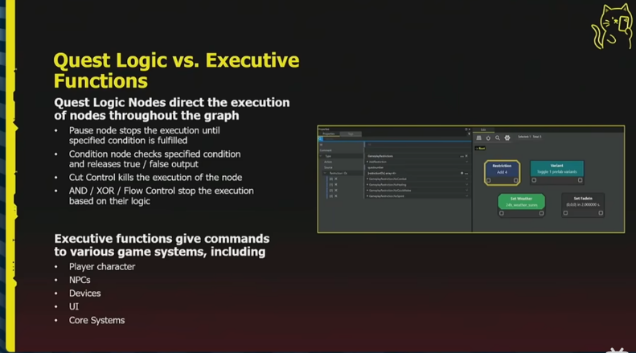
        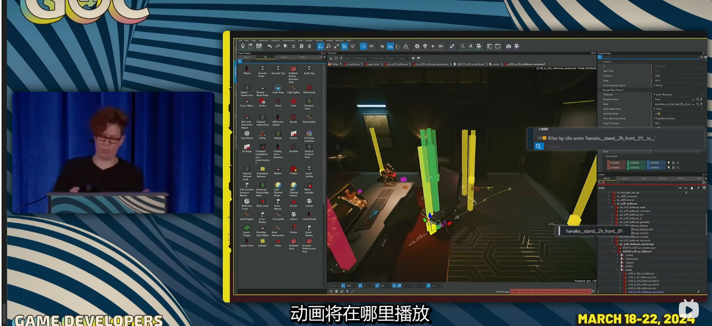
* **节点分类原因：**
     **职责分离 (Separation of Concerns)：** 这是最根本的原因。将任务的“思考”（逻辑功能节点）和“行动”（执行功能节点）分开，能使任务图表更清晰、更易于管理。
     **流程清晰与可读性 (Clarity and Readability)：** 使设计师可以快速识别一个节点是用于**控制流程走向**（逻辑节点）还是用于**对游戏世界造成实际影响**（执行节点），从而提升复杂任务图表的阅读和维护效率。
     **可复用性与标准化 (Reusability and Standardization)：** 逻辑节点（如 AND/OR）通常是通用的，可以在任何地方复用。执行节点连接特定的底层系统，职责分离使得这些**底层系统**的维护和更新更容易，而不会影响逻辑控制的稳定性。
     **强大的复杂性处理能力 (Handling Complexity)：** 这种划分使得任务设计师可以专注于构建复杂的决策树（逻辑功能），然后再挂接上对应的行动指令（执行功能），有效管理了《赛博朋克 2077》这类任务流程巨大的复杂性。

### 2.2. 场景编辑器 (Scene Editor) (00:06:37 - 00:09:27)
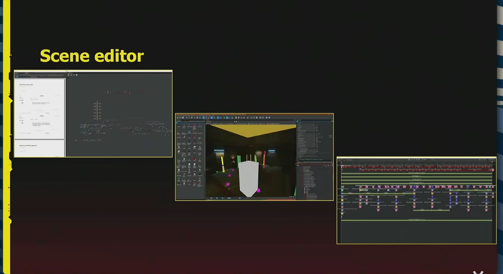
* **功能定位：** 设置游戏中的对话、过场动画和场景互动。
* **组件结构：**
    * **图表 (Graph)：** 包含“选择”和“片段”节点，定义对话分支和结构。
    * **剧本面板 (Script Panel)：** 显示对话文本。
    * **时间线 (Timeline)：** 精细控制事件时机，包括对话、动画姿势、目光注视、面部表情、音效和特效事件。
    * **视口 (Viewport) 和场景点 (Scene Spots)：** 视口显示场景在世界中的位置，场景点用于放置和设置角色动画的位置。
* **工作流：** 允许在编辑器中直接预览和播放特定片段。

### 2.3. 日志编辑器 (Journal Editor) (00:09:29 - 00:10:04)
**将功能和可能性拓展到叙事工具领域** 

**Extend our Functionalities and Possibilities to Other Narrative Tools**
* **功能定位：** 管理所有与叙事内容相关的只读数据（称为“on screens”）。
* **功能：** 载玩家叙事中的背景故事信息，在叙事的关键时刻用日志的形式支撑一个丰富且前后一致的世界，构建自身的开放世界背景。
* **内容包括：** 任务目标条目、人物资料库条目、邮件、网站内容、芯片文本等。
*   **定位：** 将叙事的功能拓展到其他可以呈现叙事的工具上，有助于优化叙事中的世界观的打造，降低定制化的知识对玩家的沉浸感的破坏
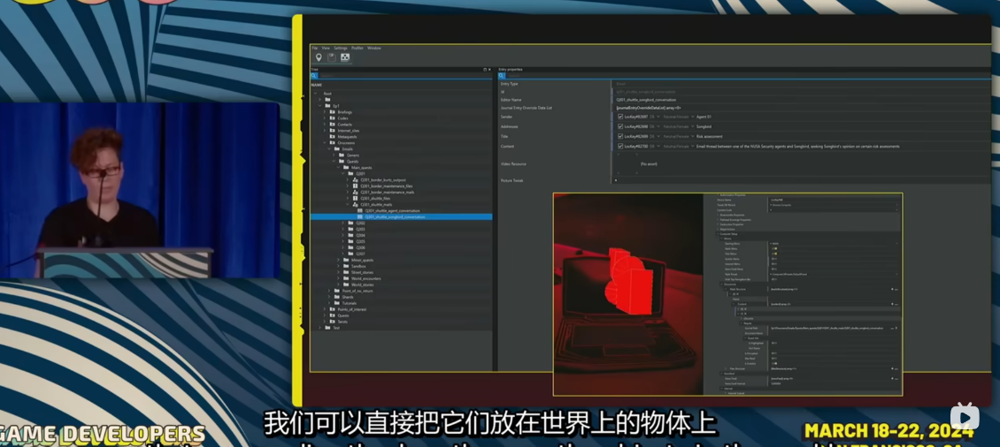
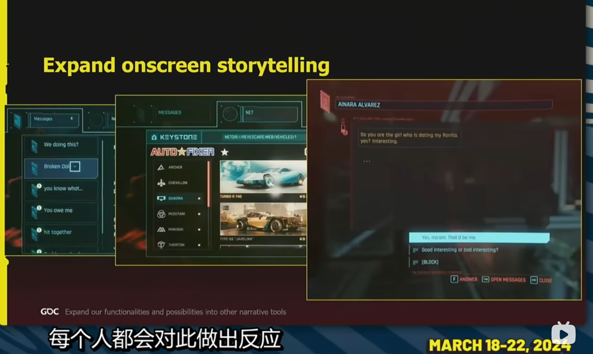
## 3. 叙事工具的设计原则与理念 (00:10:07 - 00:36:20)

### 3.1. 总体目标与核心痛点 (00:10:07 - 00:11:32)
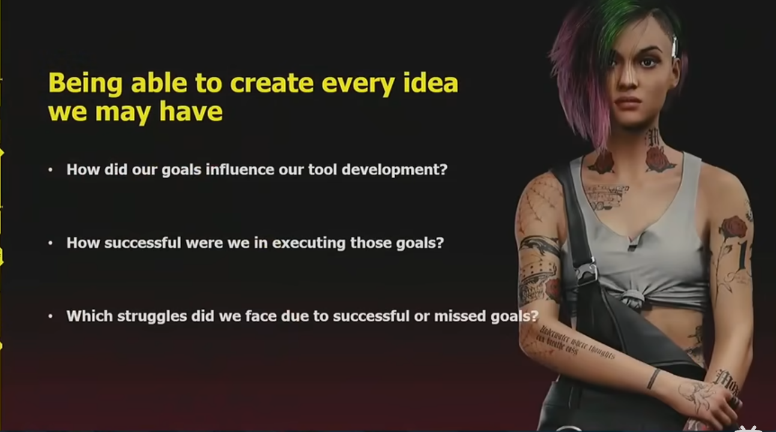
* **总体原则：** 集中化、标准化、易于访问。
* **核心目标：** 确保设计师能够实现所有想法，不被工具限制。**痛点借鉴：** 《巫师3》开发后期，设计师经常受限于工具，不得不依赖程序员来实现想法。
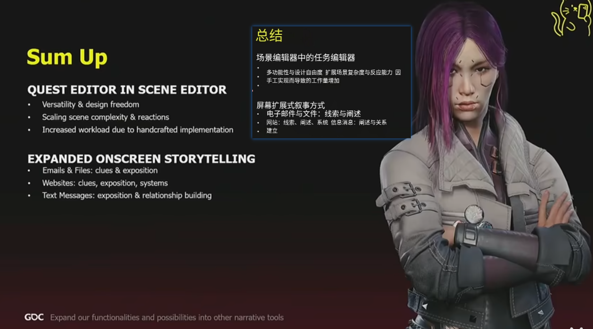
### 3.2. 三大设计原则的细节实施 (00:11:32 - 00:30:43)
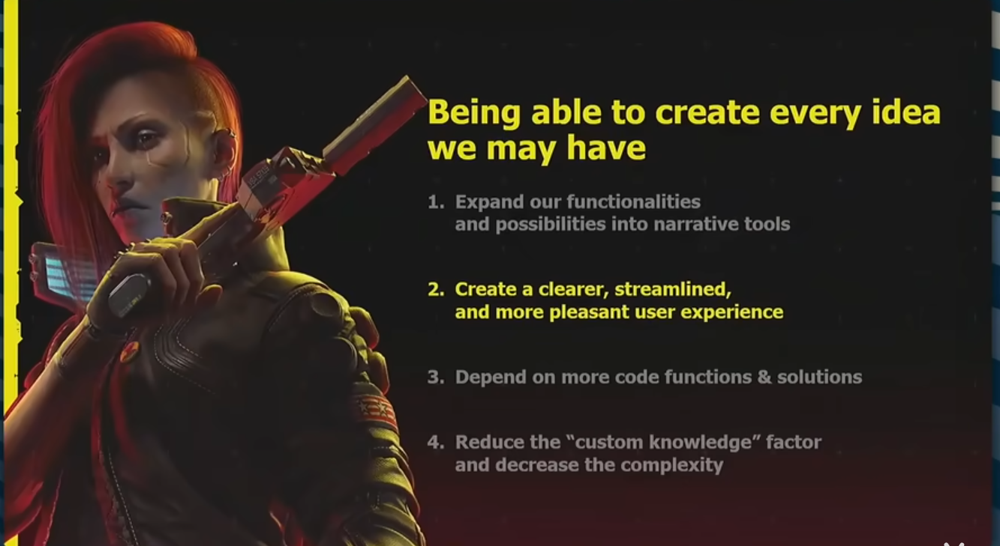
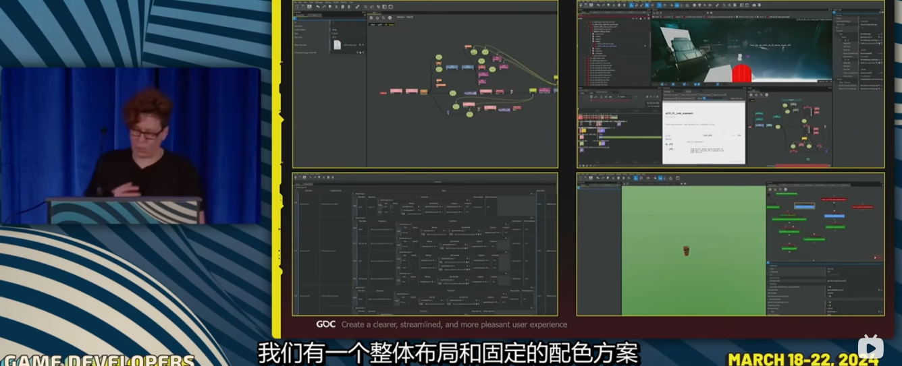
**Create a Clerar,streamlined,and More Pleasant user experience.**
1. **保持一致性 (Consistency)**
这是为了减少设计师在不同工具之间切换时的心智负担和困惑。
* 跨编辑器操作一致性： 努力确保在任务编辑器、场景编辑器等不同工具中，操作方式和快捷键是相似的或相同的。例如，在不同的图表编辑器中，按住 Shift 键并移动节点的操作都是“复制并粘贴”节点。

2. **提升可读性 (Readability)**
这是为了让复杂的任务图表更容易被理解和维护。

* 颜色和形状区分： 使用不同的颜色和形状来区分图表中的不同节点类型，让设计师能一眼识别它们的功能。例如：
    * 执行功能 (Execute Functions) 使用方框。
    * 任务逻辑功能 (Task Logic Functions) 使用特殊。

3. **分支管理与可控的复杂性 (Controlling Complexity)**
在大型开放世界游戏中，任务图表往往非常庞大和复杂，这会让人感到不知所措。

    * 分支查看器 (Branch Viewer)： 引入了这个工具来管理任务中的分支复杂度。它允许设计师在任务的任何给定点上，动态地查看所有可能的路径和分支，但同时也能让他们根据需要放大或缩小复杂程度。
    * 通用结构与模板： 通过创建模板和通用函数，来标准化实现相似功能的节点结构，防止不同的设计师使用多种方式来实现相同的功能，从而简化了任务的阅读和调试。
4. **优化对话工作流 (Scene Editor Improvements)**
场景编辑器是处理对话和表演的核心工具，改进重点在于效率。
    * 场景点的改进 (Scene Spot Improvements)： 优化了场景点（即角色站位和动作位置）的功能，使其能被更智能地使用，避免设计师每次都要手动调整大量参数。

5. **倾听设计师反馈 (Designer Feedback Loop)**
除了技术改进，他们还建立了一个系统来收集和响应工具用户的反馈。
    * 设计师反馈系统： 设立了一个内部的系统（类似于错误报告系统，但更注重功能请求），让任务设计师可以报告工具问题，更重要的是，提出新的工具功能请求和改进意见。这确保了工具的迭代是基于实际用户需求的。

6.  **数据驱动和灵活性 (Data-Driven and Flexible)：**
    * 系统设计应易于添加新系统、调整现有系统。
    * **示例：** 能够灵活检查玩家的“人生道路”（流浪者、公司职员、街头小子），从而改变 NPC 消息和提问，实现叙事上的多样性。

7.  **易于访问和标准化 (Accessible and Standardized)：**
    * 确保新用户能够快速上手并使用工具。
    * 通过使用清晰的逻辑节点和预定义的结构（例如，用于探索序列的结构）来保持任务编辑器图表的清晰度和可读性。

8.  **高效和节省时间 (Efficient and Time-Saving)：**

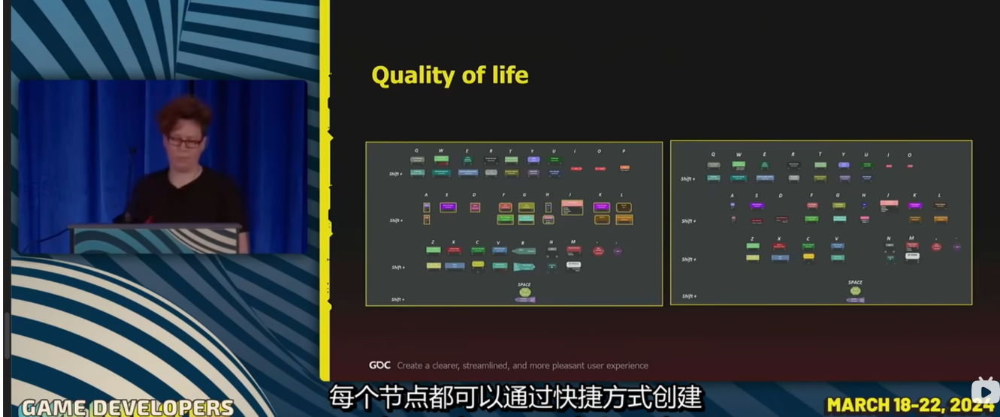
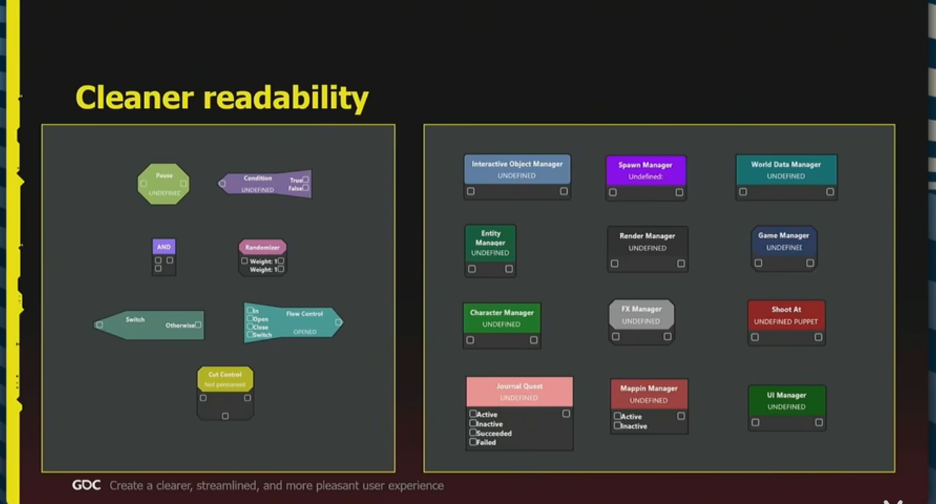
逻辑节点形状和直观度应该和普通执行节不一样应该做到清晰直观表达效果
快捷键系统
    * 注重工作流的优化，即使是很小的改进也要尽早实施。
    * **量化效益：** 考虑到游戏中任务编辑器有约 **12 万** 个节点，场景编辑器有约 **20.5 万** 个片段，每个节点或片段节省 5 秒钟的差异，累积起来将节省巨大的开发时间。
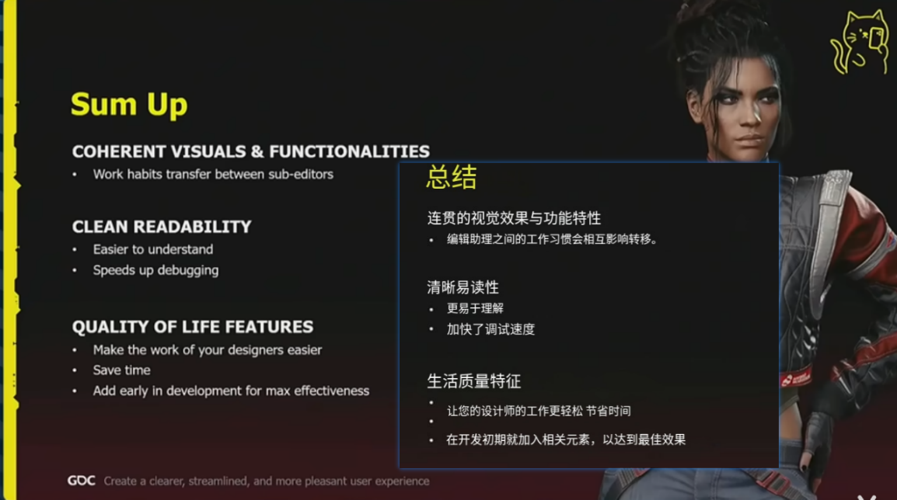

### 3.3. “一招制敌”原则 (One Node to Rule Them All Parameter Function  ) (00:30:43 - 00:36:20)
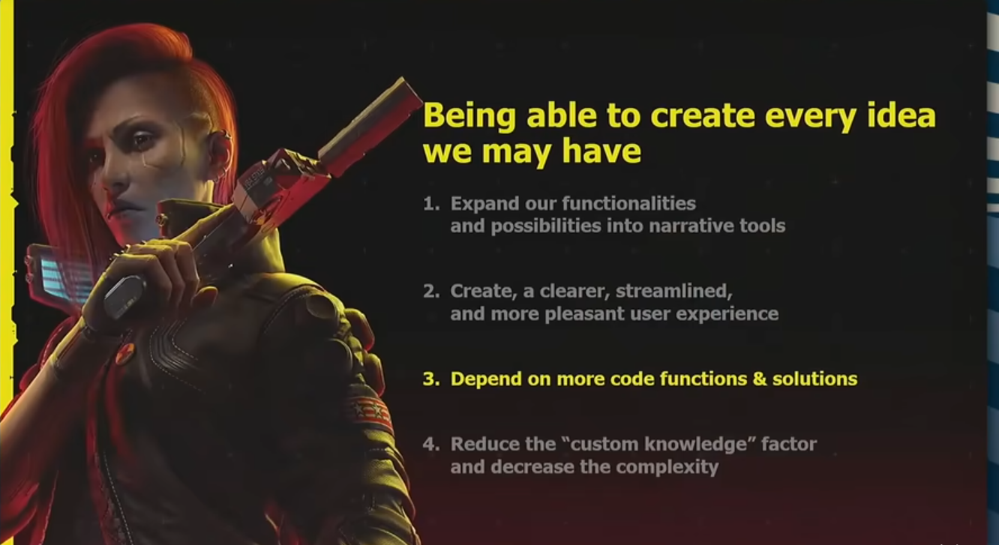
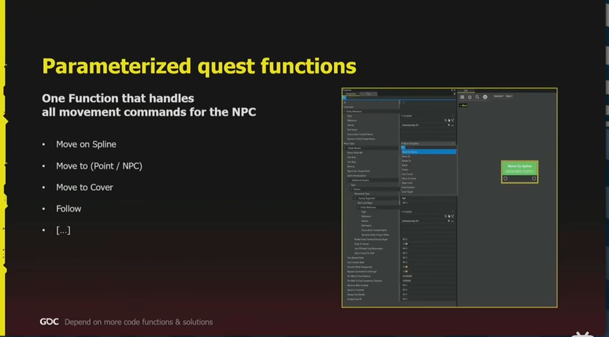
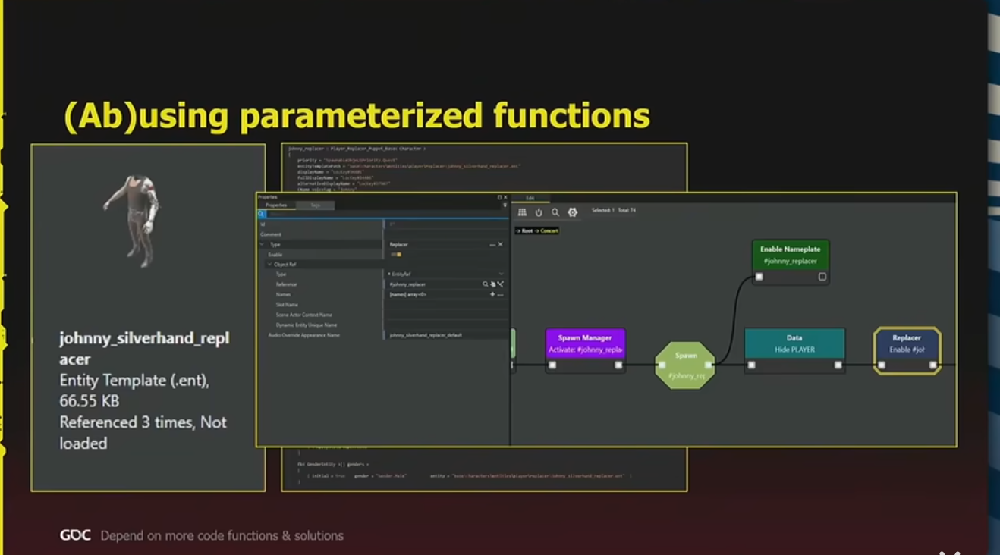

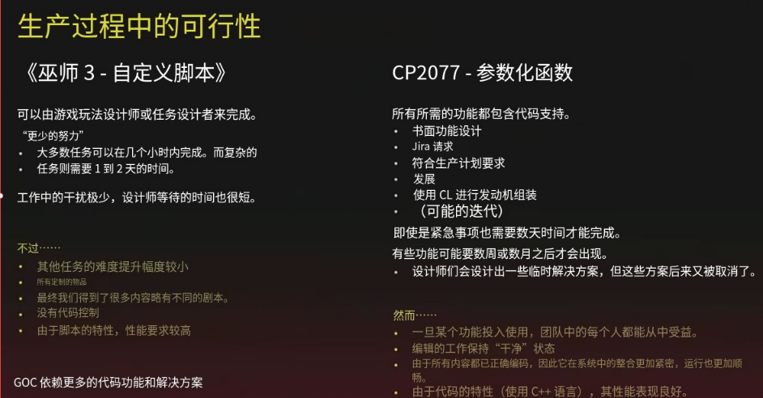
在叙述别人的故事时候选择让玩家亲身经历其他角色的人生事件
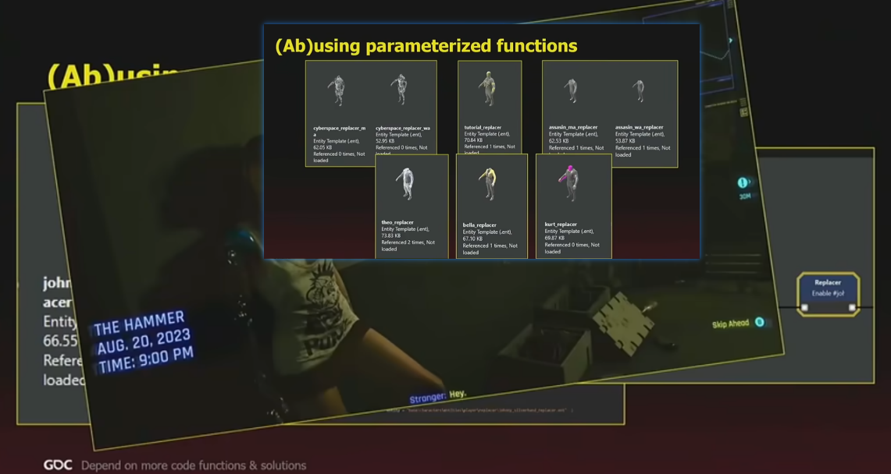
* **原则内容：** 避免为每个变体功能创建单独的节点。一个通用函数/节点（如“Move”节点）应该能处理所有变体命令，并通过属性定制化（例如，处理所有 NPC 移动类型）。
* **优势：** 保持编辑器界面整洁；保证了功能的标准化实现；确保设计师能自动受益于程序员对系统的编码改进。

## 4. 经验教训与工具使用实例 (00:36:20 - 00:48:38)

### 4.1. 工具的局限性与教训 (00:36:20 - 00:43:32)
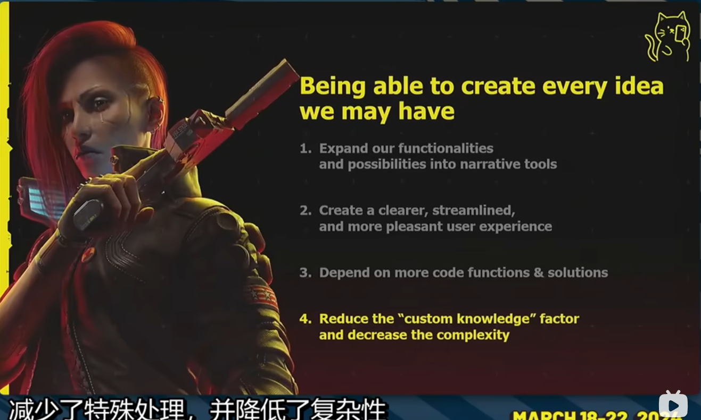

* **不理想之处：** 系统过于灵活，可能被用于创建过于复杂的、难以维护的逻辑设置（例如，一个场景的设置可能涉及大量条件检查）。
* **经验教训：**
    1.  仅有文档不足够。
    2.  必须为新员工提供更深入的实践培训，并建立技术审核（Tech Reviews）流程，以强制执行实施标准。
* **培训：**
建立一个新人工具使用Library 
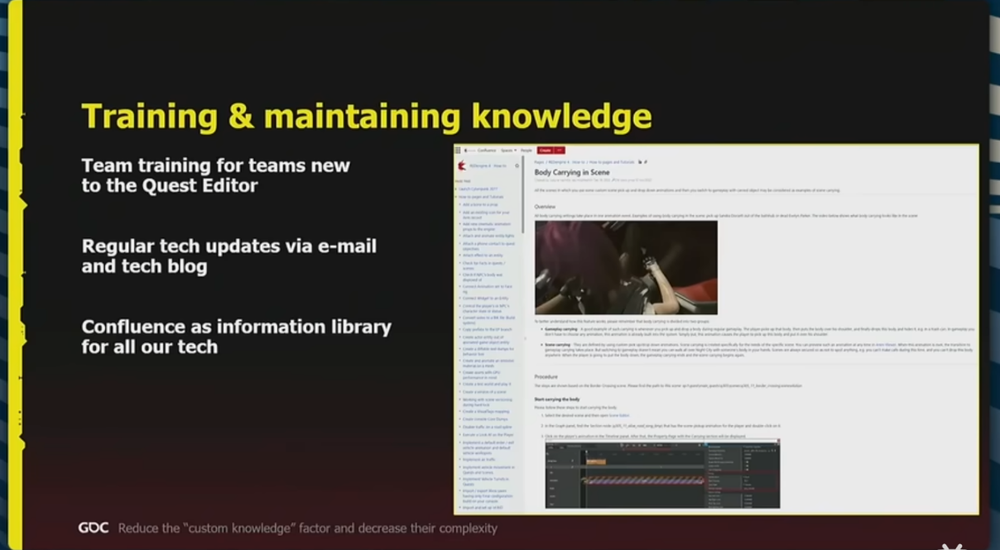
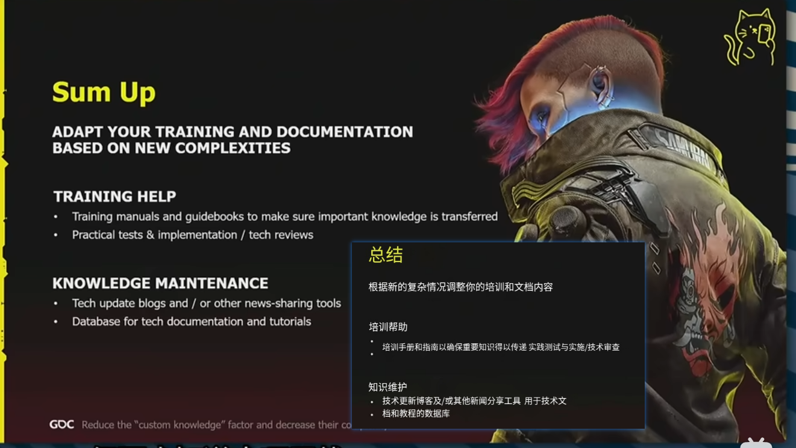
### 4.2. 复杂的工具应用示例 (00:43:32 - 00:48:38)

* **“金字塔之歌”（Pyramid Song）潜水任务 (00:43:32 - 00:45:00):**
    * 游戏中没有原生的 NPC 潜水功能。
    * 该任务的潜水部分是利用工具进行的一个“大黑科技”（big hack），主要由过场动画设计师利用现有工具的灵活性完成。
* **超梦（Braindance）调查 (00:45:00 - 00:47:00):**
    * 结合了叙事与调查。
    * 工具必须支持新的特定功能，包括：玩家倒带/快进、脱离演员身体以第三人称视角观察、以及感知不同的图层（音频/视觉）。
    * 团队通过制作简单的原型来快速验证概念并指导工具开发。
* **地铁系统 (00:47:00 - 00:48:38):**
    * 在《赛博朋克 2077：终极版》中引入的整个地铁系统（列车移动、乘客随机设置、玩家位置切换）都是通过任务和场景结构来处理和管理的。

## 5. 最终总结与开发建议 (00:48:38 - 00:51:47)

1.  **不要重复造轮子：** 重复利用现有的解决方案和功能，而非为每个新需求都编写新代码。
2.  **用户友好性优先：** 始终优先考虑工具的用户友好性，尤其是考虑到团队规模（接近一百人），并基于用户最常使用的功能进行优化。
3.  **创建并强制执行实施标准：** 随着团队规模的扩大，必须制定并严格执行实施标准，以保持代码和任务图表的清晰度和效率。
4.  **建立坚实的基础并持续迭代：** 确保功能易于扩展。工具的迭代和改进不能停止（团队一直迭代到终极版发布前三个月）。
5.  **“能做不等于应该做”：** 尽管工具提供了强大的灵活性，但要谨慎使用这种能力，避免创建过度复杂的解决方案。
6.  **培训员工：** 对于复杂的工具，完善的员工培训和招聘流程至关重要。

---
* **结尾 (00:51:47 - 00:52:58):** 感谢听众，进入问答环节，并提及 Project Orion 的招聘信息。